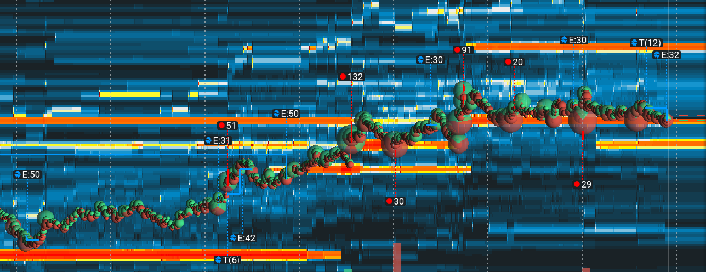

# ScreenSpacePainter

The icons on the image below is ScreenSpacePainter.

## Example Code

    import java.awt.BasicStroke;
    import java.awt.Color;
    import java.awt.Graphics2D;
    import java.awt.image.BufferedImage;
    
    import velox.api.layer1.annotations.Layer1ApiVersion;
    import velox.api.layer1.annotations.Layer1ApiVersionValue;
    import velox.api.layer1.annotations.Layer1SimpleAttachable;
    import velox.api.layer1.annotations.Layer1StrategyName;
    import velox.api.layer1.data.TradeInfo;
    
    @Layer1SimpleAttachable
    @Layer1StrategyName("Last trade + icons: live")
    @Layer1ApiVersion(Layer1ApiVersionValue.VERSION2)
    public class LastTradeDemoIconsNoHistory extends LastTradeDemoNoHistory{

        private BufferedImage makeRandomArrow(boolean isBid) {
        BufferedImage icon = new BufferedImage(50, 40, BufferedImage.TYPE_INT_ARGB);
        Graphics2D graphics = icon.createGraphics();
        graphics.setColor(isBid ? Color.GREEN : Color.RED);
        graphics.setStroke(new BasicStroke(5));
        graphics.drawLine(3, 3, icon.getWidth(), icon.getHeight());
        graphics.drawLine(3, 3, 20, 3);
        graphics.drawLine(3, 3, 3, 20);
        graphics.dispose();
        return icon;
        }

        @Override
        public void onTrade(double price, int size, TradeInfo tradeInfo) {
            super.onTrade(price, size, tradeInfo);
            
            /*
             * Note, that adding icons on every trade will lead to huge number of icons when
             * zooming out far and this might affect performance
             */
            BufferedImage arrow = makeRandomArrow(tradeInfo.isBidAggressor);
            lastTradeIndicator.addIcon(price, arrow, 3, 3);
        }
    }

Check the [ScreenSpacePainter demos](https://github.com/BookmapAPI/DemoStrategies/tree/master/Strategies/src/main/java/velox/api/layer1/simpledemo/screenspacepainter) for more information.